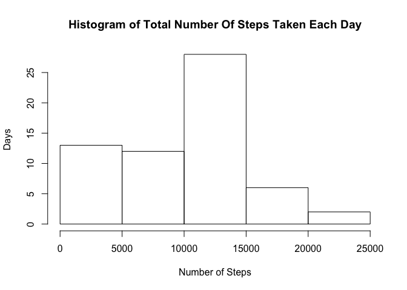
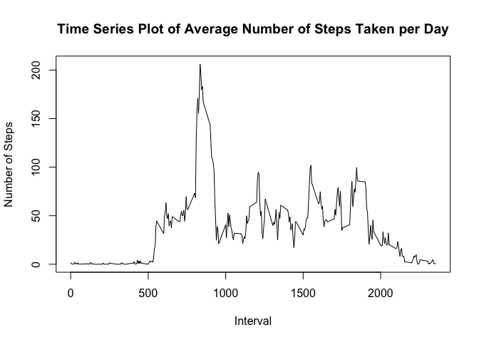
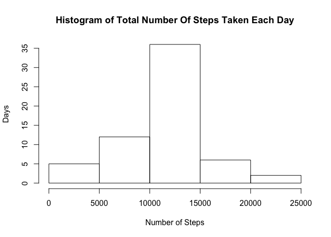
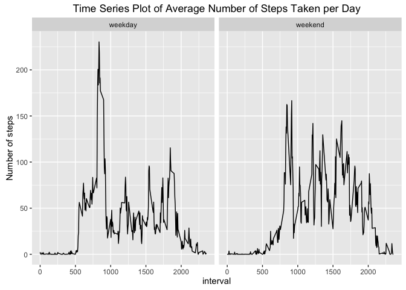

# Reproducible Research: Peer Assessment 1

## Unzip the data file and load the data

```r
unzip('activity.zip', file = 'activity.csv')
dat <- read.csv('activity.csv')
```

## What is mean total number of steps taken per day?  
### Plot the histogram of total number of steps taken per day

```r
total_steps <- tapply(dat$steps, INDEX = dat$date, FUN = sum, na.rm = TRUE)
hist(total_steps, xlab = 'Number of Steps', ylab = 'Days',
     main = 'Histogram of Total Number Of Steps Taken Each Day')
```

<!-- -->

### Calculate the mean and median of the total number of steps taken per day

```r
mean(total_steps)
```

```
## [1] 9354.23
```

```r
median(total_steps)
```

```
## [1] 10395
```

## What is the average daily activity pattern?  
### Make a time series plot of average number of steps taken per day

```r
avg_steps <- tapply(dat$steps, INDEX = as.factor(dat$interval),
            FUN = mean, na.rm = TRUE)
plot(names(avg_steps), avg_steps, type = 'l', xlab = 'Interval', 
     ylab = 'Number of Steps',
     main = 'Time Series Plot of Average Number of Steps Taken per Day')
```

<!-- -->

### Let's find out which time interval contains the maximum number of steps

```r
names(which.max(avg_steps))
```

```
## [1] "835"
```

## Imputing missing values
### Let's find out the total number of missing values in the dataset

```r
sum(is.na(dat$steps))
```

```
## [1] 2304
```

### Take a look at the distribution of missing data in terms of day

```r
na_index <- is.na(dat$steps)
table(dat$date[na_index])
```

```
## 
## 2012-10-01 2012-10-02 2012-10-03 2012-10-04 2012-10-05 2012-10-06 
##        288          0          0          0          0          0 
## 2012-10-07 2012-10-08 2012-10-09 2012-10-10 2012-10-11 2012-10-12 
##          0        288          0          0          0          0 
## 2012-10-13 2012-10-14 2012-10-15 2012-10-16 2012-10-17 2012-10-18 
##          0          0          0          0          0          0 
## 2012-10-19 2012-10-20 2012-10-21 2012-10-22 2012-10-23 2012-10-24 
##          0          0          0          0          0          0 
## 2012-10-25 2012-10-26 2012-10-27 2012-10-28 2012-10-29 2012-10-30 
##          0          0          0          0          0          0 
## 2012-10-31 2012-11-01 2012-11-02 2012-11-03 2012-11-04 2012-11-05 
##          0        288          0          0        288          0 
## 2012-11-06 2012-11-07 2012-11-08 2012-11-09 2012-11-10 2012-11-11 
##          0          0          0        288        288          0 
## 2012-11-12 2012-11-13 2012-11-14 2012-11-15 2012-11-16 2012-11-17 
##          0          0        288          0          0          0 
## 2012-11-18 2012-11-19 2012-11-20 2012-11-21 2012-11-22 2012-11-23 
##          0          0          0          0          0          0 
## 2012-11-24 2012-11-25 2012-11-26 2012-11-27 2012-11-28 2012-11-29 
##          0          0          0          0          0          0 
## 2012-11-30 
##        288
```
Form the summary of missing data above, we know that some days' **whole** chunk of measurements are missing. To impute the chunk of daily missing data, we might make use of **the average number of steps taken per day** we computed before, in particular, with the variable `avg_steps`, to fill the missing chunks.

### Create a new dataset with the missing data filled in.

```r
new_dat <- dat
na_days = unique(as.character(dat$date[na_index])) #days with missing data
new_dat[ new_dat$date %in% na_days, ]$steps <- avg_steps #fill the missing data with avg_steps
```

### Make a histogram of the total number of steps taken each day with the new dataset

```r
new_total_steps <- tapply(new_dat$steps, INDEX = new_dat$date, 
                          FUN = sum, na.rm = TRUE)
hist(new_total_steps, xlab = 'Number of Steps', ylab = 'Days',
     main = 'Histogram of Total Number Of Steps Taken Each Day')
```

<!-- -->

### Calculate the mean and median of the total number of steps taken per day with the new dataset

```r
mean(new_total_steps)
```

```
## [1] 10766.19
```

```r
median(new_total_steps)
```

```
## [1] 10766.19
```
With the missing data imputed, the mean and median of the total number of steps taken per day are both increased compared with those computed from the dataset with missing data. Comparing both histograms,  a clear **right shift** of trendency can be found, which means imputing missing data increases the estimation of the total daily number of steps.

## Are there differences in activity patterns between weekdays and weekends?  
### Create a new factor variable in the dataset with two levels – “weekday” and “weekend”

```r
#question 4
date <- as.Date(new_dat$date, "%Y-%m-%d")
weekdays <- weekdays(date)
weekdays[ weekdays %in% c('Saturday', 'Sunday') ] <- 'weekend'
weekdays[ weekdays != 'weekend' ] <- 'weekday'
new_dat$weekdays <- as.factor(weekdays)
```

### Make a time series plot of average number of steps taken in weekdays versus weekend

```r
library(dplyr)
library(ggplot2)
```


```r
new_dat_df <- tbl_df(new_dat)
grouped_dat <- group_by(new_dat_df, interval, weekdays)
summarised_dat <- summarise(grouped_dat, avg_steps = mean(steps))
ggplot(summarised_dat, aes(x = interval, y = avg_steps)) +
    ggtitle("Time Series Plot of Average Number of Steps Taken per Day") +
    ylab("Number of steps") + geom_line() + facet_grid(.~weekdays)
```

<!-- -->
